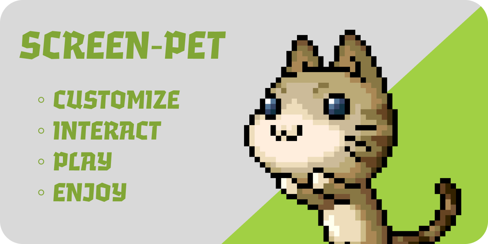

# Screen-Pet

Little fully customizable project, which allows you to add your character on your screen and interact with it

# Installation

Install Python 3.10-3.12

Install source code from this repository

Run console in folder with `launcher.py` file

```bash
  python -m pip install requirements.txt
  python launcher.py
```
    
# Adding custom characters

## Basics

#### Folder structure

```
  Character name
  |
  └──── options.json
  └──── icon.png
  |
  └──── falling... (Animation frames for falling)
  └──── frame... (Animation frames for walking (1st for idle))
  └──── writing... (Animation frames for chillinh)
  └──── tackle... (Animation frames for attacking player mouse)
  └──── dragging... (Animation frames for dragging)
```

#### Options file
```json
{
  "move": AMOUNT_OF_MOVE_ANIMATION_FRAMES,
  "tackle": AMOUNT_OF_MOVE_ATTACKING_FRAMES,
  "writing": AMOUNT_OF_MOVE_CHILLING_FRAMES,
  "rotateWriting": SHOULD_ROTATE_WHILE_CHILLING,
  "size": HEIGHT_ON_SCREEN_IN_PIXELS,
  "maxSpeed": MAX_SPEED (can be changed in options),
  "jumpHeight": JUMP_HEIGHT (can be changed in options),
  "dragging": 1,
  "falling": AMOUNT_OF_MOVE_FALLING_FRAMES
}
```

## Advanced

#### Additional folder structure
```
 Character name
  |
  └──── newfunc.py
  |
  |
  └──── newfunc... (Animation frames for new function)
```

#### Additional options structure
Replace "?" with number of your custom function (starting from 0). If there will be no number between two functions - function with higher number won't load. If there is number between two function and lower number function didn't load because of error - it will be skipped up to higher number function. 
```json
{
  "custom?": "new_func",
  "custom?_chance": 0.3,
  "custom?_length": 10,
  "custom?_rotate": false,
}
```

If you want to add script, which will work always (not single-time action) - you need to add `main_script`

```json
{
  "main_script": "main_script"
}
```


#### newfunc.py structure
```python
  def action(params):
    pass

  def animate(params):
    return new_cur_frame
```

#### main_script.py structure
```python
    def tick(params):
    new_params = params.copy()
    return new_params
```

Parameters from `params`

| Parameter | Type     | Description                       |
| :-------- | :------- | :-------------------------------- |
| `current_frame`      | `int` | Number of current animation frame |
| `x`      | `int` | X coordinate (in pixels) of top left corner of pet |
| `y`      | `int` | Y coordinate (in pixels) of top left corner of pet |
| `width`      | `int` | Width (in pixels) of pet |
| `height`      | `int` | Height (in pixels) of pet |
| `cur_thought`      | `string` | Current action of pet |
| `mouseX`      | `int` | X coordinate (in pixels) of mouse cursor |
| `mouseY`      | `int` | Y coordinate (in pixels) of mouse cursor |

Structure of `animate` function 
| Parameter | Type     | Description                       |
| :-------- | :------- | :-------------------------------- |
| `new_cur_frame`      | `int` | Number of next animation frame from current animation sequence |

Structure of `params` in `tick` function (tick function activates every 100ms, which means it will activate 10 times per second)
| Parameter | Type     | Description                       |
| :-------- | :------- | :-------------------------------- |
| `current_frame`      | `int` | Number of current animetion frame for current animation sequence |
| `x`      | `int` | X coordinate (in pixels) of top left corner of pet |
| `y`      | `int` | Y coordinate (in pixels) of top left corner of pet |
| `cur_thought`      | `string` | Current action of pet |

## FAQ

#### Can I use this project code to make my project?

Yes, of course. Feel free to use this code. _By the way, I'll be very thankful if you will leave reference for this project in your_

#### I want ████ feature in project. When will you add it?

This project is WIP, which means - more possibilities in the future. But if you want your specific feature to be added sooner - feel free to make pull requests or write your suggestions in "Issues" category

#### OMG, this code is terrible!!! Why is it so?

This project is my first project made to be opensource, so there may be a lot of features, troubles, bugs of little things, which should not be made while making opensource project. If you want to help me to fix something, make code cleaner or just want to join development - feel free to do so.

#### I can't make new pet by myself, but I really want to see ████ in the skins library. Will you add ████ ?

Yes and no. Current 2 skins - are only skins, which are gonna be in this repository, made by me. But there is a high possibility, that I will create second repository with just skins of characters you ask for.

#### Why my custom function doesn't work ?

There are 4 possible reasons:
- There is some issues in current version of Screen-pet, try to downgrade version of source code
- Your files called incorrectly, check name of your files and compare it to file names in "options.json"
- Your functions called incorrectly, compare function names with right names in this documentary
- Your function causes error, try to debug it and check, if there is any issues

#### I downloaded ████ project, which appears to be fork from yours and I have ████ issue, can you help me?

No. I don't support any forks of my project, because it may have big changes of source code. You should ask fork's owner about your issue.

#### Which coffee do you prefer?

I like caramel-banana ice latte very much, but most of the time I drink espresso :3
